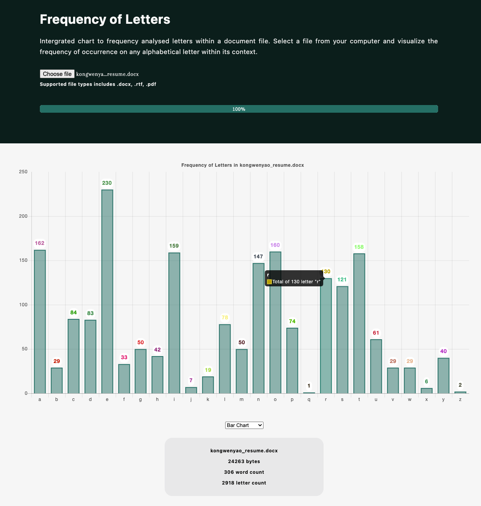

# Frequency of Letters

Check the preview [here](https://frequency-visualisation.netlify.app)

## Reference

- [Express handlebars](https://github.com/foundersandcoders/express-handlebars-workshop)
- [Read Files](https://web.dev/read-files/)
